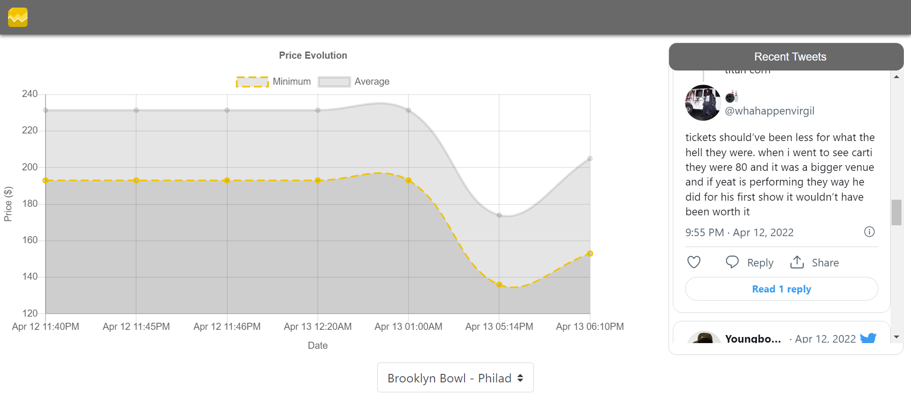
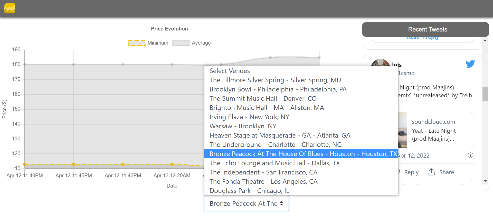

# Tickpick Price Tracker

## Functionalities

This python project aims to build a website for tracking prices of a ticket reselling platform tickpick.com.

### I. Price chart

As seen in the picture the user can track the evolution of prices for a given concert. The location can be chosen with a drop-down menu as seen below.

The price of the cheapest ticket is indicated by the yellow dashed line and the average price is plotted with a solid grey line. This way the user can have an overview of when to sell or buy tickets, following the trends.

### II. Twitter feed
Prices can be heavily influenced by the release of a new album or a bad performance in a previous concert. Therefore a live tweet feed is provided to the user so he can inform his decisions. 

## Technical details
There are two technical parts in this project:
- python script running in the cloud scraping prices on tickpick.com
- website implemented with django and python, javascript, css, html

### I. Python scraper running on AWS
A selenium python script emulates a chrome navigator and starts by fetching the links of each concert on the page https://www.tickpick.com/concerts/artist/.

Once all the links are retrieved, we don't need to emulate a chrome navigator anymore and we can simply send HTTP requests to retrieve json objects containing all the informations (i.e. prices and quantity of tickets for a given location).

Finally information about each ticket is stored on an Azure MySQL database.

The script is then run every hour on AWS EC2 with a cron job. 

Another python script is used to fetch tweets containing the name of the artist as a keyword. Tweets are then stored in another table on the Azure database.

## Technical difficulties

The scraper was a nightmare to setup with selenium, first of all my scraper was being blocked by anti-bot detection on tickpick.com. To counter this I had to use a stealthy version of selenium (undetected_chromedriver) in order to bypass CloudFare detection. This was not enough as I was running the webdriver in a headless mode (i.e. without opening a window of the navigator). To bypass this I had to emulate a fake display on the AWS EC2 instance and setup an arbitrary size so that the content could load.